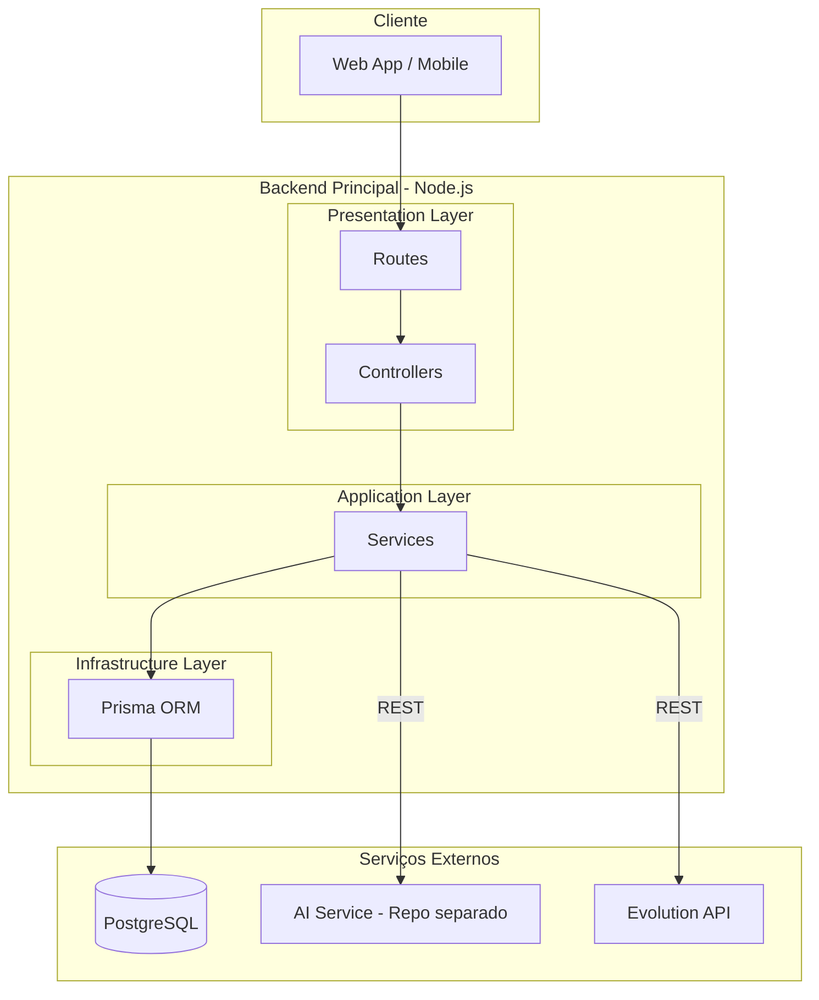

# Plano: Estrutura Inicial do Backend CRM-AI

## Princípios Arquiteturais

- **Separação de responsabilidades:** Camadas bem definidas (Presentation → Application → Infrastructure)
- **Inversão de dependência:** Controllers dependem de abstrações (services), não de implementações
- **Fail-fast:** Validação de env e inputs na borda da aplicação
- **Observabilidade:** Logging estruturado e health checks desde o dia 1

---

## Decisão Arquitetural: Módulo de IA

**Decisão:** Serviço de IA em **projeto/repositório separado** (Python + FastAPI).

**Implicações:**

- Este repositório (`crm-ai-backend`) contém apenas o backend principal (Node.js)
- O serviço de IA terá seu próprio repo (ex: `crm-ai-service`), pipeline e deploy
- Comunicação via REST: backend consome a API do serviço de IA
- Contrato da API de IA documentado em `docs/ai-service-contract.md` para referência e alinhamento entre times
- Variável `AI_SERVICE_URL` no .env aponta para a URL do serviço de IA (desenvolvimento, staging, produção)

---

## Estrutura de Pastas (Convenções da Indústria)

```
crm-ai-backend/
├── prisma/                        # Schema na raiz (convenção Prisma)
│   └── schema.prisma
├── src/
│   ├── config/                    # Env, validação, constantes
│   ├── modules/                   # Estrutura por domínio (escala melhor)
│   │   ├── health/
│   │   │   ├── health.controller.ts
│   │   │   ├── health.routes.ts
│   │   │   └── health.service.ts
│   │   └── test/
│   │       ├── test.controller.ts
│   │       ├── test.routes.ts
│   │       └── test.service.ts
│   ├── shared/                    # Código transversal
│   │   ├── errors/                # AppError, ValidationError, etc.
│   │   ├── middlewares/           # errorHandler, requestLogger, rateLimit
│   │   ├── utils/
│   │   └── types/
│   ├── infrastructure/            # Implementações concretas (opcional)
│   │   └── database/              # PrismaClient singleton, repositories
│   ├── app.ts
│   └── server.ts
├── docs/                          # Documentação (incl. contrato AI)
├── tests/
│   ├── unit/
│   └── integration/
├── .env.example
├── .env
├── .gitignore
├── .eslintrc.cjs
├── .prettierrc
├── package.json
├── tsconfig.json
├── vitest.config.ts
├── docker-compose.yml
└── README.md
```

**Por que `modules/` em vez de `controllers/` + `routes/` flat?** Agrupa por domínio (feature-based), facilita crescimento e mantém coesão. Cada módulo é autocontido.

---

## Padrões de Código e Segurança


| Prática                     | Implementação                                                                           |
| --------------------------- | --------------------------------------------------------------------------------------- |
| **Logging estruturado**     | `pino` + `pino-http` — JSON logs, requestId, níveis (info/warn/error)                   |
| **Tratamento de erros**     | Classe `AppError` (status, code, message) + middleware que formata resposta padronizada |
| **Formato de resposta API** | Envelope: `{ success, data?, error? }` — consistência para clientes                     |
| **Validação de entrada**    | Zod para body/query/params — rejeitar requests inválidos na borda                       |
| **Rate limiting**           | `express-rate-limit` — proteção contra abuso (ex: 100 req/15min por IP)                 |
| **CORS**                    | Origens configuráveis via `CORS_ORIGINS` no .env                                        |
| **Graceful shutdown**       | Handler para SIGTERM/SIGINT — fechar conexões e encerrar limpo                          |


---

## Fluxo de Implementação

### 1. Criar Projeto Backend

- Inicializar `package.json` com TypeScript, Express, Prisma
- `tsconfig.json`: strict mode, `paths` para aliases (`@/config`, `@/shared`)
- Scripts: `dev`, `build`, `start`, `test`, `lint`, `db:migrate`, `db:studio`
- ESLint + Prettier (configs compartilhadas)
- Husky + lint-staged (opcional): pre-commit com lint

### 2. Configurar Servidor Express

- `[src/app.ts](src/app.ts)`: express.json, cors, helmet, rate-limit, pino-http, rotas
- `[src/server.ts](src/server.ts)`: bootstrap, listen, graceful shutdown
- Ordem dos middlewares: security → logging → routes → errorHandler (último)

### 3. Estrutura de Pastas (Feature-based)

- Módulos `health` e `test` em `src/modules/`
- Cada módulo: `*.routes.ts`, `*.controller.ts`, `*.service.ts`
- `src/shared/errors/`: `AppError`, `ValidationError` (extends AppError)
- `src/shared/middlewares/`: `errorHandler`, `requestLogger`, `rateLimiter`

### 4. Configurar Variáveis de Ambiente

- `.env.example` com todas as variáveis documentadas:
  - `PORT`, `NODE_ENV`, `LOG_LEVEL`
  - `DATABASE_URL`
  - `CORS_ORIGINS` (ex: `http://localhost:3000`)
  - `AI_SERVICE_URL`, `EVOLUTION_API_URL`, `EVOLUTION_API_KEY`
- `src/config/env.ts`: schema Zod, `env` export validado no import
- `.env` no `.gitignore`

### 5. Endpoints de Teste

- `GET /health` — liveness (sem DB), retorna `{ status: 'ok', uptime }`
- `GET /api/v1/health` — readiness (com DB), retorna status de dependências
- `GET /api/v1/test` — smoke test `{ ok: true, timestamp }`
- Prefixo `/api/v1` para versionamento

### 6. Integração com Banco (Prisma + PostgreSQL)

- `prisma/` na raiz (convenção oficial)
- Schema mínimo: modelo para validar conexão (ex: `HealthCheck` ou seed)
- Migração inicial
- `src/infrastructure/database/prisma.ts`: singleton do PrismaClient
- Health readiness verifica `$queryRaw` ou `$connect`

### 7. Documentação Swagger

- `swagger-jsdoc` + `swagger-ui-express`
- Anotações JSDoc nos controllers
- Rota `/api-docs` (desabilitar em produção ou proteger)
- Especificação OpenAPI 3.0

### 8. Testes (Vitest + Supertest)

- `vitest.config.ts`: environment node, coverage opcional
- Setup de teste: mock do Prisma ou DB em memória (opcional para MVP)
- Integração: `GET /health` 200, `GET /api/v1/test` estrutura correta
- Script `test` e `test:coverage`

### 9. Docker Compose

- Serviço `postgres`: imagem 15-alpine, volume, healthcheck
- Variáveis via `.env` ou `env_file`
- Rede interna para comunicação backend ↔ postgres

### 10. Documentar Contrato do Serviço de IA (externo)

- `docs/ai-service-contract.md`: especificação do contrato REST esperado (endpoints, payloads, respostas) para o serviço de IA em projeto separado. Facilita desenvolvimento paralelo e integração futura.

---

## Diagrama de Arquitetura



*O serviço de IA (Python/FastAPI) vive em repositório próprio e é consumido via REST.*


**Fluxo de requisição:** Request → Middlewares (security, log, rate-limit) → Route → Controller → Service → Prisma/HTTP → Response

---

## Dependências Principais

**Produção:**

- `express`, `cors`, `helmet`, `express-rate-limit`
- `prisma`, `@prisma/client`
- `dotenv`, `zod`
- `pino`, `pino-http`
- `swagger-jsdoc`, `swagger-ui-express`

**Desenvolvimento:**

- `typescript`, `ts-node`, `ts-node-dev`
- `vitest`, `supertest`, `@vitest/coverage-v8`
- `eslint`, `prettier`, `@typescript-eslint/`*
- `husky`, `lint-staged` (opcional)

---

## CI/CD (Recomendado)

- **GitHub Actions:** workflow em `.github/workflows/ci.yml`
  - Lint: `npm run lint`
  - Testes: `npm run test`
  - Build: `npm run build`
  - (Opcional) Deploy em staging/produção via workflow separado

---

## Ordem de Execução Sugerida

1. package.json + tsconfig + .gitignore + ESLint + Prettier
2. Estrutura de pastas (modules, shared) + app.ts + server.ts
3. .env.example + validação Zod
4. shared/errors + middlewares (errorHandler, logger, rateLimit)
5. Prisma + Docker Compose + migração
6. Módulos health e test (routes, controllers, services)
7. Swagger
8. Testes Vitest
9. README + docs/ai-service-contract.md
10. (Opcional) Husky + CI workflow

---

## Observações

- **EvolutionAPI:** Módulo `src/integrations/evolution/` quando integrar; variáveis de env por ora.
- **DBeaver:** Usar `DATABASE_URL` do .env; Prisma migrations gerenciam o schema.
- **Repository pattern:** Para MVP, usar Prisma diretamente nos services. Abstrair em repositories quando houver necessidade de testes unitários ou mock de DB.
- **Serviço de IA:** Projeto separado (ex: `crm-ai-service`). Backend consome via `AI_SERVICE_URL`; contrato documentado em `docs/ai-service-contract.md`.

